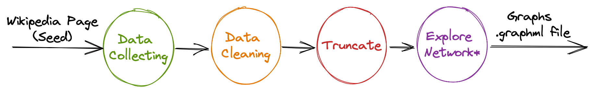
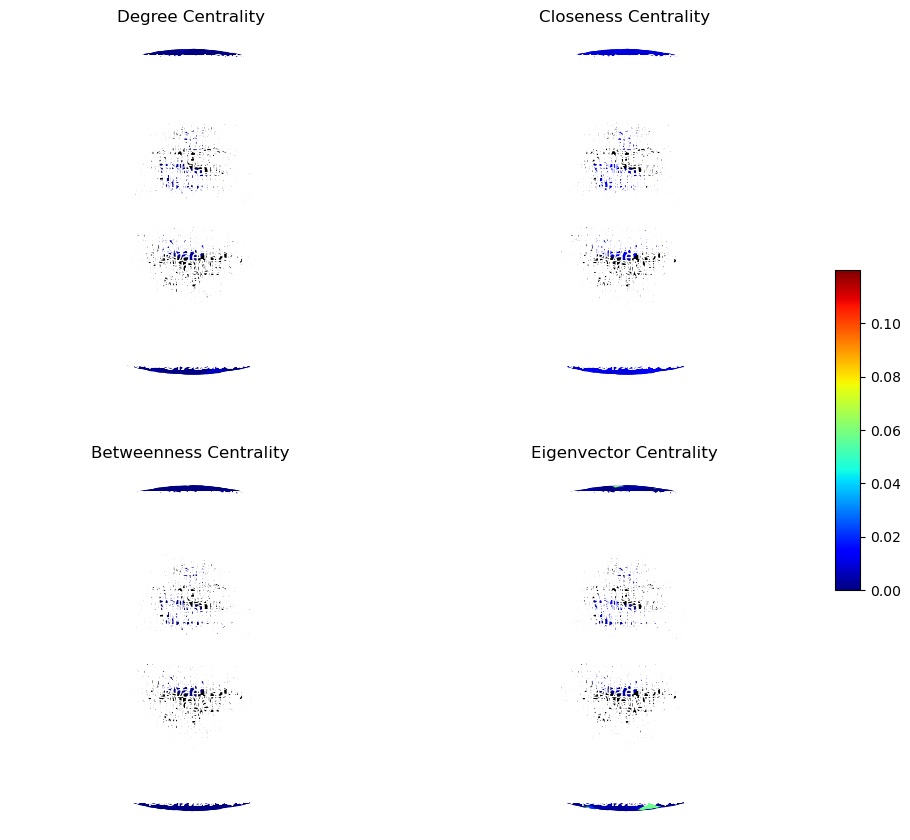
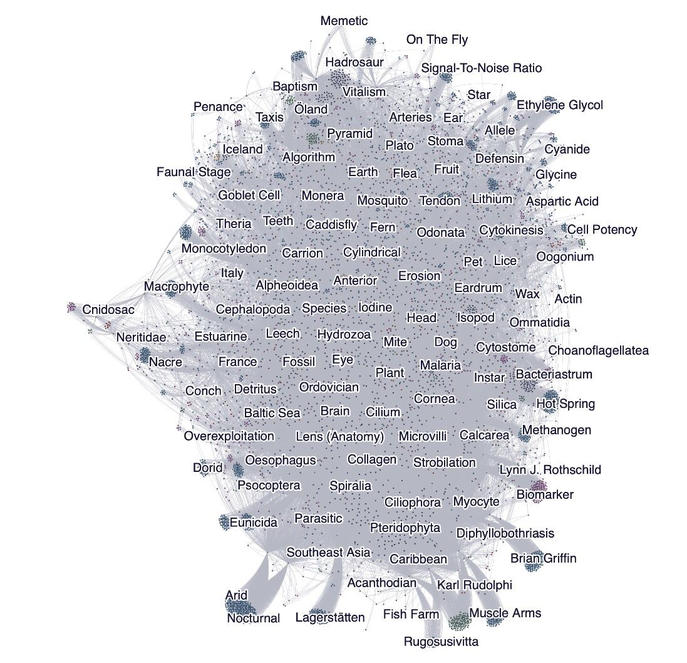

# Generating a Network from a Wikipedia Page!

This project has the goal to generate a network from a single `Wikipedia` page (seed page) and to analyze how the pages are connected to each other based on different metrics. 

Due to the amount of computational power and time to process all data, we are only exploring the network until the second layer, which already include a lot of nodes and connections to be analyzed. 

Another goal of this project is to create a pipeline that receives a starting page from wikipedia and includes all the processing phases. 

It's important to mention that this project is a collaboration between the students [Aryel Medeiros](https://github.com/aryelmedeiros) and [Deborah Moreira](https://github.com/deborahmoreira) 

>  :art: **Interact with graph using [Retina/Gist](https://ouestware.gitlab.io/retina/beta/#/graph/?url=https%3A%2F%2Fgist.githubusercontent.com%2Fdeborahmoreira%2F932375630c4c0d0642d44405bc8409c4%2Fraw%2Fabceff5bb96e483ac59c0e832bde935b755b750b%2Fvertebrate_gephi.graphml&r=d&sa[]=co&sa[]=r&ca[]=g%20e-s&ca[]=g%20s-s&ca[]=g-s&ca[]=e-s&ca[]=cl-s&ca[]=h-s&ca[]=b-s&ca[]=m-s&ca[]=i-s)**

## Part I - Build the network and explore it's metrics

* :movie_camera: Quick explanation about this section 

### Pipeline

The suggested data pipeline is consisted of 4 explicit steps: `Data Collecting`, `Data Cleaning`, `Truncate` and `Explore the Network`. This last one is actually a "condensed" step that includes other tasks that analyze the network and generate graphs according to determined metrics. 

To define the pipeline we create a class and define the functions that represent each task as well as the corresponding task that it depends on to operate. This assures that the tasks will be executed in the correct order. 

#### Data Collecting 
	
The first task of the pipe line receives the first wikipedia page to be explored. Then, using the wikipedia library the web scraping is performed to extract all the referenced pages in previous page to define the new nodes and connections of the network. 

Also, because of the numerous amount of pages that are connect and the huge amount of time that would take to process other layers of the network, we are only extracting nodes until the second layer. Moreover, we stipulated pages that are end point to the extraction by manually exploring the network, these pages are defined as `STOP` and should represents leaf nodes or nodes that possibly are not relevant to the original topic.

The seed page that we decided to explore in this project is the Wikipedia Page about Vertebrate. After the initial extraction of the network until the second layer, there were found around 2.8k nodes and 68k edges. 

#### Data Cleaning 

After the initial definition of the nodes on the netwok, now we need to eliminate all duplicate nodes, nodes that are actually the same page and topic, the only difference would be the title having an extra 's' or a '-'. Not only duplicate nodes, but we also want to remove all the loop edges, meaning a page that refers to itself. 

#### Truncate 

On this step of the pipeline, a function is responsible to filter all nodes that have a degree less or equal to 2, since these nodes don't represent such important nodes. In the first step of the data collecting, there was `2.8k nodes and 68k edges`. After removing all the duplicates, loop edges and truncating the network,  we ended up with around `7005 nodes and  42038 edges.`

#### Show Edges
The total number of nodes and edges after cleaning the data is acttuly a dedicated simple task of the pipeline.

#### Explore the Network

As previously mentioned, this step of the pipeline is in fact a group of subtasks responsible to analyze the network by some metrics involving: degree, closeness, betweenness, eigenvector, centrality distributions, k-core and k-shell.

##### :bar_chart: Graph Metrics 

The first analysis of the network performed consist in evaluating the nodes folling such metrics: 

 - **Degree centrality**: the number of neighbors (connections) of a node.
 - **Closeness centrality**: distance of a node to all other nodes of the network. A lower value of this metric is iqual to a longer distance.
 - **Betweenness centrality**: the position of a node on the shortest path.
 - **Eigenvector centrality**: measure the importance of a node based on its neighbors. 

After passing our network to this task, we obtained the following image to represent all 4 metrics explained above: 

##### :bar_chart: Centrality Distributions

The analysis performed on this task is based on two density  functions: `Probability Density Function`(PDF) and `Cumulative Density Function` (CDF). Functions that are applied over the metric of degree, previously explained.

 - **Probability Density Function** (PDF): gives the probability of a node having the degree **equal** to X.
 - **Cumulative Density Function** (CDF): gives the probability of a node having the degree **equal or less** to X.

According tho de PDF curve for degree metric above, it's possible to see that almost 100% of nodes on the network have a degree less than 100. The CDF curve also confirms this evaluation: 

##### :bar_chart: All Centrality Distributions

This task compare all the metrics.

Taking a look at the image displayed above, it's possible to see areas that represent clusters in the network. Furthermore, we can say that Eigenvetor distribution has almost a linear look. 

##### :bar_chart: K-Core and K-shell 

For the core decomposition of the network the k-core and k-shell metrics are used on this task. The first one indicates subnet  with all nodes having at least k neighbors and the second one represents the shell, nodes that have to be eliminated to reach a k-core. 

First we discovered how many k-cores the network had and then we displayed in blue and the k-shel is displayed in red. 

## Part II - Different ways to draw the network

Using some tools such as [Gephi](https://gephi.org/), [Retina](https://ouestware.gitlab.io/retina/beta) and [Gephisto](https://jacomyma.github.io/gephisto/) we can visualize our network in different colors and shapes, which help us to better understand what was builded in previous section.

### Gephi

With this powerful tool it's possible to import the `.grapml` that we already have and calculate many other metrics easily. Futhermore, this open-source tool allow us to represent the color of nodes based on a metrics and create mutiple filters as needed.

* :globe_with_meridians: See the network as a HTML page 

The image shown above reflect our graph when its painted using **in-degree** metric &ndash; that is, the number of edges that reach a node &ndash; and some layouts &ndash; a property based on phisycs laws (ForceAtlas 2) and few expansions were applied until we get a "feel good" shape. 

After this, a filter was applied selecting that nodes with a higher degree and putting the on a interval that is represented by a color as it follows:
* nodes with degree 10 to 38 : deep purple
* nodes with degree 38 to 86 : yellow
* nodes with degree higher than 86 : orange
	
As you can see, these steps are intrisic to each network.

### Retina

Retina its another interesting tool, actually a plugin of Gephi, where we can publish our network on famous world wide web and let anyone interact with it. The link to the page created it's on begin of this readme file and also [here](https://ouestware.gitlab.io/retina/beta/#/graph/?url=https%3A%2F%2Fgist.githubusercontent.com%2Fdeborahmoreira%2F932375630c4c0d0642d44405bc8409c4%2Fraw%2Fabceff5bb96e483ac59c0e832bde935b755b750b%2Fvertebrate_gephi.graphml&r=d&sa[]=co&sa[]=r&ca[]=g%20e-s&ca[]=g%20s-s&ca[]=g-s&ca[]=e-s&ca[]=cl-s&ca[]=h-s&ca[]=b-s&ca[]=m-s&ca[]=i-s).

* :movie_camera: Exploratory analysis using few metrics on Retina 

### Gephisto

Gephisto it's another way to draw our network using a web based tool. When our `.grapml` is uploaded the result it's the image bellow.

In this representation, automatically generated in Gephisto, the size of a node depend on out-degree. The following collors represent a descending order of in-degree: 
* nodes with degree = 6 : yellow
* nodes with degree = 5 : red
* nodes with degree = 4 : green
* nodes with degree = 3 : pink
* nodes with degree = 2 : blue
The predominant grey color means all other degrees non represented with the mentioned collors. 

Our first shell is composed by that nodes with degree = 2, it's a filter on our pipeline and we can call them leaves (in blue). Examining few displayed labels, we can see that they are nodes with degree = 2, that is, this visualization emphasizes first shell. In addition, Gephisto always choose different ways to draw the graph.

## References

([Ivanovitch's Repository](https://github.com/ivanovitchm/datastructure))
